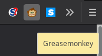
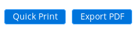
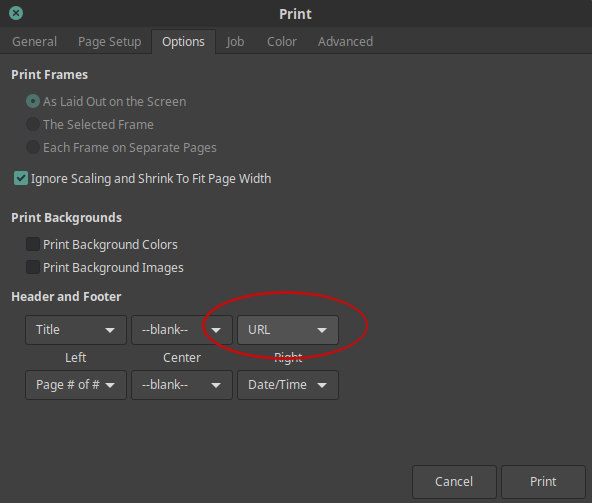

# Quickprint

Quickprint is a tool written in JavaScript with jQuery designed to simplify the repetitive and error-prone nature of attempting to print a document from Ellucian Colleague. Without Quickprint, printing a document from Colleague can take 8+ steps before the document can be printed. With Quickprint, that number of steps is effectively reduced down to 2.

The script is compatible with [Greasemonkey](https://addons.mozilla.org/en-US/firefox/addon/greasemonkey/) on Mozilla Firefox and [Tampermonkey](https://chrome.google.com/webstore/detail/tampermonkey/dhdgffkkebhmkfjojejmpbldmpobfkfo?hl=en) on Google Chrome.

## Installation Instructions

Instructions to install this script are given for Greasemonkey on Firefox; however, installation into Tampermonkey is relatively the same.

0. Before anything else, install Greasemonkey if you haven't already.
1. Copy all of the contents of `quickprint.js` from the GitHub repository.
2. Now, locate Greasmonkey in your browser and click it to reveal the menu.

3. Click the option that says "**New User Script**".
4. From here, paste the contents of `quickprint.js` into this window.
5. **IMPORTANT**: You will need to replace the link at the top with your Colleague UI link. This is the URL you see in your browser when using Colleague.
6. Save the script by clicking "**Save**"

## Usage

The benefit of using Quickprint is seamless and automatic. It simplifies the user interface by providing you with a 1-click button for generating invoices:

Clicking the "Quick Print" button immediately pops up the browser's print window, allowing the user to print MUCH faster than before. If the user has a "Print to PDF" plugin installed, the user can generate PDF invoices much faster than the "**Export PDF**" option does.*

*_The default "Export PDF" button is still available in the event that the user prefers to utilize this option instead._

## Fixing the "about:blank" issue

The goal of this script is to be as responsive and simple as possible for future maintenance. Due to the noninvasive nature of this script, there is a small issue that arises when printing invoices. In particular, each invoice printed will display the web address of the page printed. This issue cannot be fixed in a way that plays nicely across browsers. The best solution is to disable printing of the URL in the print options dialog:

Change this option to "--blank--". Invoices will no longer display the unsightly "`about:blank`" tag. 
