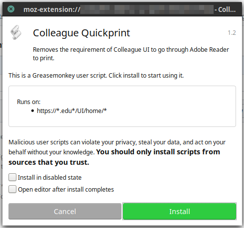

# Quickprint

Quickprint is a tool written in JavaScript with jQuery designed to simplify the repetitive and error-prone nature of attempting to print a document from Ellucian Colleague. Without Quickprint, printing a document from Colleague can take 8+ steps before the document can be printed. With Quickprint, that number of steps is effectively reduced down to 2.

The script is compatible with [Greasemonkey](https://addons.mozilla.org/en-US/firefox/addon/greasemonkey/) on Mozilla Firefox and [Tampermonkey](https://chrome.google.com/webstore/detail/tampermonkey/dhdgffkkebhmkfjojejmpbldmpobfkfo?hl=en) on Google Chrome.

## Installation Instructions

Instructions to install this script are given for Greasemonkey on Firefox; however, installation into Tampermonkey is relatively the same.

0. Before anything else, install Greasemonkey if you haven't already.
1. Next, [visit the Raw data for](https://github.com/cabrito/quickprint/raw/master/quickprint.user.js) `quickprint.user.js`. This should automagically activate Greasemonkey (or Tampermonkey!) that you're trying to install a new script.

2. Allow the script to install.
3. (Optional) Update the `@include` URL to be specific for your domain if it doesn't match yours.
4. (Optional) If your institution does not have have the AUX printing enabled on documents, you may erase all the contents of the function `formatData` in the code and replace it with `return data;` 
5. That's it! You're ready to go!

## Usage

The benefit of using Quickprint is seamless and automatic. It simplifies the user interface by providing you with a 1-click button for generating invoices:

Clicking the "Quick Print" button immediately pops up the browser's print window, allowing the user to print MUCH faster than before. If the user has a "Print to PDF" plugin installed, the user can generate PDF invoices much faster than the "**Export PDF**" option does.*

*_The default "Export PDF" button is still available in the event that the user prefers to utilize this option instead._

## Fixing the "about:blank" (or similar) issue

The goal of this script is to be as responsive and simple as possible for future maintenance. Due to the noninvasive nature of this script, there is a small issue that arises when printing invoices. In particular, each invoice printed will display the web address of the page printed. This issue cannot be fixed in a way that plays nicely across browsers. The best solution is to disable printing of the URL in the print options dialog:

Change this option to "--blank--". Invoices will no longer display the unsightly "`about:blank`" tag. When printing from Chrome, this option exists natively in the printing pop-up already under "**More settings**", and unchecking "**Headers and footers**".
